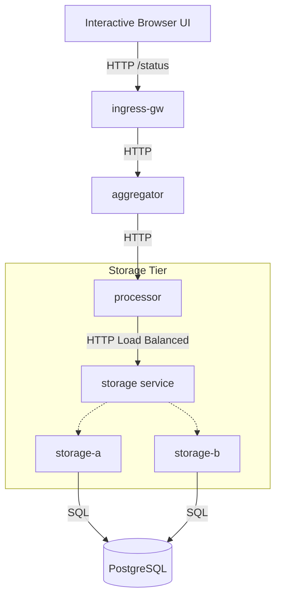

# MeshApp — Interactive Observability Demo

MeshApp is an interactive, multi-tier microservices application designed to generate rich, realistic telemetry data for the Grafana observability stack (Tempo, Mimir, Loki). It uses OpenTelemetry for distributed tracing and Prometheus for metrics.

## Architecture

The application consists of 5 main components plus a PostgreSQL database:



- **Ingress-gw (Edge):** Serves the interactive HTML UI and acts as the entry point.
- **Aggregator:** Collects requests and forwards them.
- **Processor:** Handles logic and queries the downstream unified `storage` service.
- **Storage-a / Storage-b:** Leaf nodes that process requests and execute SQL queries against PostgreSQL.
- **Postgres:** Stores data generated by the application.

*Note: Traces, logs, and metrics are sent to Grafana Alloy via OTLP (`alloy-alloy-receiver`).*

## Getting Started

### 1. Deploy the Application
Apply all manifests in this directory to your Kubernetes cluster:
```bash
kubectl apply -f .
```

### 2. Access the Interactive UI
Port-forward the `meshapp-ingress-gw` service to your local machine:
```bash
kubectl port-forward svc/meshapp-ingress-gw -n meshapp 3000:3000
```
Then, open your browser and navigate to: **http://localhost:3000**

## Running Tests via the UI

The UI provides three main test scenarios you can trigger with a single click:

1. **🚀 Healthy Request (Insert DB)**
   - Sends a normal request through the entire stack.
   - The storage node will execute an `INSERT` statement into the PostgreSQL `test_data` table.
   - **What to look for:** A complete green trace in Grafana Tempo showing spans from `meshapp-ingress-gw` all the way down to a `pg.query` span at the leaf.

2. **💥 DB Bad Request (Invalid Query)**
   - Sends a request instructing the leaf node to execute a malformed SQL query (`SELECT * FROM non_existent_table`).
   - The application gracefully handles the error, but the OpenTelemetry instrumentation automatically records the SQL exception.
   - **What to look for:** A trace in Grafana Tempo with an error marker on the leaf span. Click on the error to see the exact SQL syntax exception.

3. **🐢 DB Slow Query (`pg_sleep`)**
   - Sends a request instructing the database to pause execution using `SELECT pg_sleep(3)`.
   - **What to look for:** A trace in Tempo where the `pg.query` span is extremely long (3 seconds). This allows you to visualize and isolate slow database queries in your application stack.

4. **🐌 Stress: Latency (Node.js)**
   - Injects a 200ms artificial delay into the Node.js processing pipeline.
   - **What to look for:** A visually stretched trace in Grafana Tempo, highlighting where the latency occurred in the call chain.

5. **🔥 Stress: CPU Burn (Pyroscope)**
   - Forces every microservice in the call chain to execute a heavy, blocking busy-loop (math calculations) for 500ms each.
   - **What to look for:** Open the **Pyroscope** app in Grafana. You will see a massive spike in CPU usage, and the flamegraph will clearly pinpoint the `handle` function executing the `Math.sqrt` busy-loop as the bottleneck.

---

## 🧪 Chaos Engineering via Environment Variables

For continuous background stress (ideal for testing alerts and steady-state metrics), you can inject chaos directly into the deployments using Kubernetes environment variables.

### 1. Inject Error Rate (e.g., 20% failure)
```bash
kubectl set env -n meshapp deploy/meshapp-processor STRESS_ERROR_RATE=20
```

### 2. Inject Artificial Latency (e.g., 500ms delay)
```bash
kubectl set env -n meshapp deploy/meshapp-processor STRESS_LATENCY_MS=500
```

### 3. Inject CPU Burn (e.g., 100ms busy-loop per request)
```bash
kubectl set env -n meshapp deploy/meshapp-processor STRESS_CPU_BURN_MS=100
```

### 4. Reset to Normal
```bash
kubectl set env -n meshapp deploy/meshapp-processor STRESS_ERROR_RATE- STRESS_LATENCY_MS- STRESS_CPU_BURN_MS-
```

---

## 📊 Signals Emitted

| Signal | Transport | Destination |
|--------|-----------|-------------|
| **Traces** | OTLP gRPC (`:4317`) | Alloy → Tempo |
| **Metrics** | Prometheus `/metrics` (`:3000`) | Alloy `annotationAutodiscovery` → Mimir |
| **Logs** | Stdout structured JSON | Alloy `loki.source.kubernetes` → Loki |

Every log line automatically includes a `trace_id` and `span_id`, ensuring seamless log-to-trace linking in Grafana.

cluster
│
├── monitoring namespace
│
├── Grafana
│     ├── Dashboard (your dashboard.json)
│     ├── Mimir datasource
│     ├── Loki datasource
│     ├── Tempo datasource
│     └── Pyroscope datasource
│
├── Alloy
│     ├── scrape Prometheus metrics
│     ├── collect logs
│     ├── receive OTLP traces
│     ├── receive profiles
│     └── forward everything
│
├── Mimir
│     └── metrics
│
├── Loki
│     └── logs
│
├── Tempo
│     └── traces
│
├── Pyroscope
│     └── continuous profiling
│
├── kube-state-metrics
├── node-exporter
├── cAdvisor
│
└── MeshApp
      ├── ingress-gw
      ├── processor
      ├── aggregator
      ├── storage-a
      └── storage-b